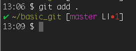
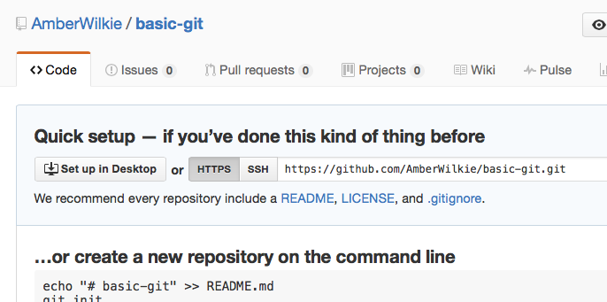

## Version Control
### What is Version Control? 
A system that records changes to files over time. 
Git allows for:
* Reverting files or entire project to a previous state 
* Comparing changes over time 
* View of who modified the source last 
* Collaboration between multiple developers
* Clients don't checkout single files, they clone the entire repository
* Many types version control systems available - we focus on git

### Why is it called “Git”?
**British mild profanity [slang](http://www.urbandictionary.com/define.php?term=git
) for silly, incompetent, stupid, annoying, senile elderly or childish person.** 

Linus Torvalds, the creator of Git, is told to have said: <br/>*“I'm an egotistical bastard, and I name all my projects after myself. First Linux, now git.”* 

Alternatively: **“Global Information Tracker” **

### Why GitHub?
Most famous online place to store git repositories. GitHub is more than just a programmer's tool. It's useful for collaborating on almost anything. 

#### Features
* Can be your team’s central project repository 
* Largest code host on the planet
* Powerful tools for  
    * Group permissions
    * Integrated issue tracking
    * Collaborative code review
    * Wikis

Head over to [Github.com](http://github.com) and sign up for an account. You'll need it for nearly everything in this course and the bootcamp itself.

### Git Commands
Git is used to keep track of changes in your projects over time. You'll make a "snapshot" of your project with a `commit`. Then you'll have a `log` of your changes and can review them. If you mess something up, you can always `revert` to a previous commit and start again from where everything was working.

#### Initializing Git
Make a new folder called `basic_git`. You can initialize version control in your folder with:
```shell
$ git init
```
This adds some hidden files to your folder, a `.git` folder that will store information about your version control. Don't touch it - git will take care of everything.


If you installed the bash profile from the last section, your terminal should look like mine: a purple `branch` and a green check box - signifying that there are no changes to commit.

Now `touch git.txt` and `atom git.txt` to create and open a file. Add some text to it - anything is fine. Save. Now if you run another command in your terminal (like `ls`), you will see that the green check mark is gone and a light blue number is there instead. That is because we have files in our folder that are not part of version control. We'll add them now.


#### Staging area
Git has a concept of a ‘staging area’. This is where we gather up all the changes we want to add to a commit or snapshot of our work. First stage all of the changes you want in a single “commit”.

Add a single file to the staging area:
```shell
$ git add [filename] 
```
Or add all changed files to the staging area:
```shell
$ git add .
```

Note that after we add our file to the staging area, either by `git add git.txt` or `git add .`, our terminal prompt has again changed colors. Now we have a red dot and a number. This means we have files staged but uncommitted.



#### Commits
Create a commit. 
```shell
$ git commit -am “commit message”
```

Your commit messages are notes to yourself and other programmers about the changes that have been made since the last commit. They should be short and helpful. Here are some examples of good commit messages:
- Add acceptance test for user registration
- Fix bug #23
- Style form for signup

It takes some practice to get good at writing commit messages. See [this article](http://chris.beams.io/posts/git-commit/) for further tips. Employers will look at your commit messages (as well as your coaches and teammates), so it's well worth the investment of time to start writing them well from the start.

#### Git Log
To see a list of your commits, run
```shell
$ git log
```
Try `git log --oneline`. Some prefer to see a more condensed version of their log.

#### Remotes
Now we'll connect our local computer to GitHub. Sign into your account. Create a new repository using the `+` sign at the top right of the screen. Copy the repository (repo for short) URL:



Now add a remote repository by replacing `repo_url` with the url you copied above:

```shell
$ git remote add origin repo_url
```
`git remote -v` will show you a list of your remotes - the online folders you can connect to. Right now we only have `origin` - that refers to our own GitHub repository online. Later you will connect with your teammates with the same functions.

####Push
Push to your remote repository
```shell
$ git push origin master 
    #or
$ git push origin my_branch:master
```

Note that several commits can be pushed to git repository at once

#### Branching
```shell
$ git branch 
$ git branch [new branch name]
$ git checkout [new branch name]
$ git checkout -b [new branch name]
$ git checkout remote/branch
$ git checkout -b branch
```

### Exercise

Create a new project and access the project folder

```shell
$ cd my_project
```
Initialize git
```shell
$ git init
Initialized empty Git repository in .git/
```

Create a file called `hello.rb` inside the `my_project` folder.
```shell
$ touch hello.rb
```

Add the following code to that file

```ruby
puts 'Hello World'
```
Run the code (just for the sake of it - it has no bearing on the exercise).
```shell
$ ruby hello.rb
```
Check the status
```shell
$ git status
```

Add the `hello.rb` file to git to track it, and create a commit
```shell
$ git add hello.rb
$ git commit -m “my first commit”
```
Check your commit history
```shell
$ git log
```

### Labs - Git Immersion
There is a very good resource available on-line that allows you to practice your git skills called Git Immersion. Head over to their website and work your way through all labs. Make sure to follow the instructions carefully and push up your work to your GitHub account.

Start [Git Immersion Labs](http://gitimmersion.com/lab_01.html)

**Note that we have covered some of the steps included in Git Immersion, but please go over everything again. Git is a very important skill to master if you want to succeed with the Craft Academy course.**
### Resources

* Git Pro on-line book - http://git-scm.com/book/en/v2
* Basic Video tutorials - http://git-scm.com/videos
* Git reference_ http://git-scm.com/docs


